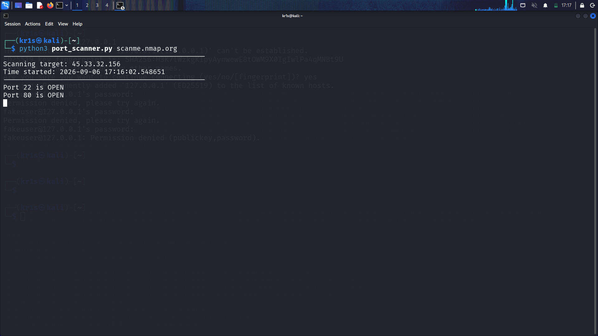
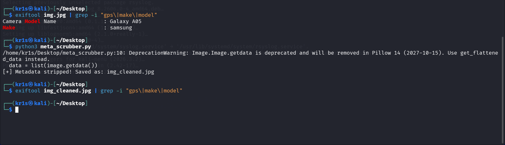
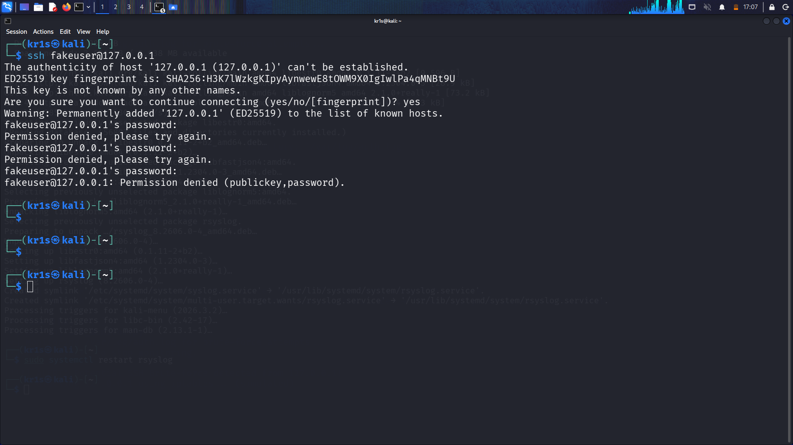
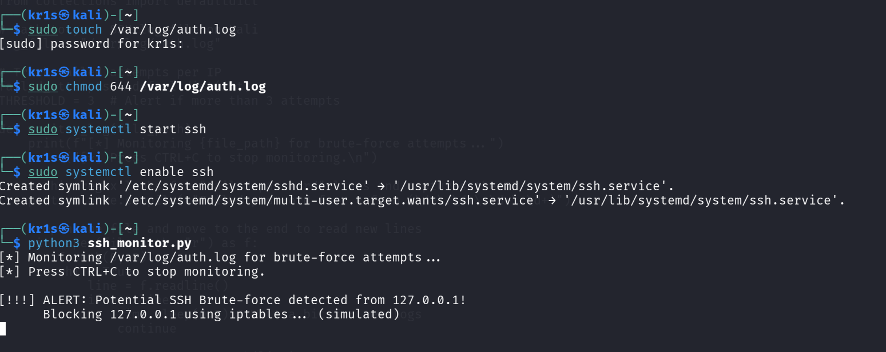

# Python Cybersecurity Toolkit

## Objective
This repository contains a collection of beginner-friendly cybersecurity tools built in Python. The goal is to demonstrate foundational understanding of networking, log analysis, and OSINT (Open Source Intelligence) through hands-on scripting.

## Tools Used
- **Python 3**
- **Kali Linux**
- **Pillow** (For Image Processing)
- **Socket & RegEx** (Standard Python libraries)

---

## Project 1: Port Scanner (`port_scanner.py`)

### Description
A basic network reconnaissance tool that scans a target IP address for open TCP ports (1-1024).

### How it works

This version uses multi-threading to scan ports in parallel, making it much faster than traditional scanners. It also includes service identification (e.g., Port 80 = HTTP, Port 22 = SSH)
### Usage
```bash
`python3 port_scanner.py <target-ip>`
```bash
`python3 port_scanner.py scanme.nmap.org`

---

## Project 2: Metadata Scrubber (`meta_scrubber.py`)

### Description
An OSINT defense tool that removes all hidden metadata (EXIF data) from an image file. Metadata can include GPS coordinates, camera model, and timestamps.

### How it works
It uses the `Pillow` library to create a pixel-perfect copy of the image while stripping away the hidden header information.

### Usage
`python3 meta_scrubber.py <image-file>`
*Example:* `python3 meta_scrubber.py my_photo.jpg`

---

## Project 3: SSH Brute-Force Detector (`ssh_monitor.py`)

### Description
A "Blue Team" defense tool that monitors system log files for repeated failed SSH login attempts. This detects brute-force attacks in real-time.

### How it works
It reads `/var/log/auth.log` using regular expressions (regex) to parse IP addresses. If an IP exceeds a set threshold of failed attempts, an alert is triggered, and the IP is simulated to be blocked.

### Usage
`python3 ssh_monitor.py`

---

## Key Takeaways
- **Sockets & Networking:** Understanding how the TCP/IP handshake works.
- **OSINT & Privacy:** How to protect users from leaking sensitive data via photos.
- **Defensive Log Analysis:** How to monitor logs to detect malicious activity.
- **Regex:** How to use pattern matching to extract valuable data from raw text.

## Proof of Work




